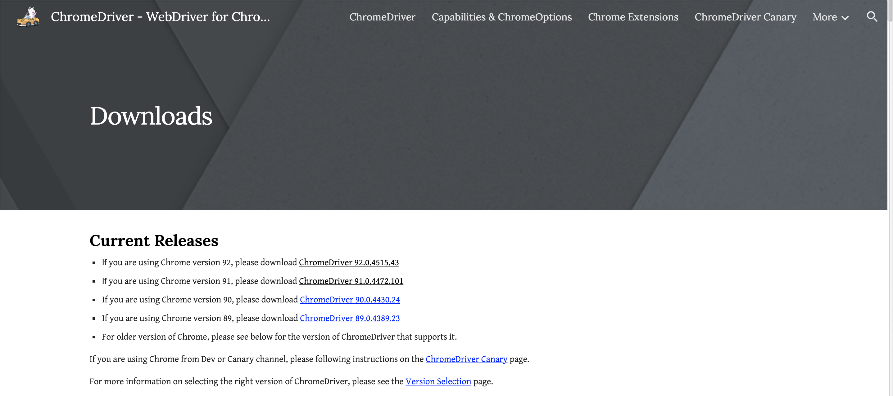

### How to Setup the Zillow Scraper:

1. Go to https://chromedriver.chromium.org/downloads and download the webdriver corresponding to your version of chrome:

2. Place the webdriver executable in a place that you will remember:

3. Copy the webdriver's filepath and enter it into the top of the main.py file.

4. You should be good to go!
---

### To view the results of the scraper:

The scraper's search results are saved to csv files inside of the "csv_output" directory that is already inside of the project folder.

---