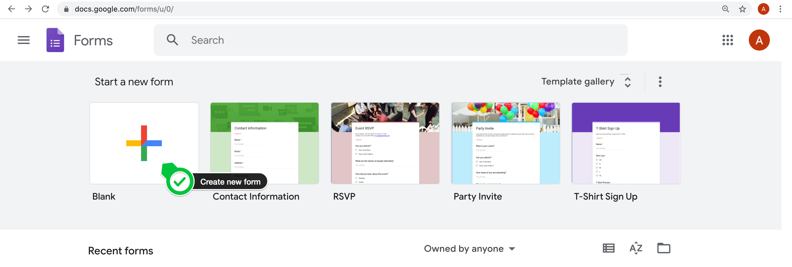
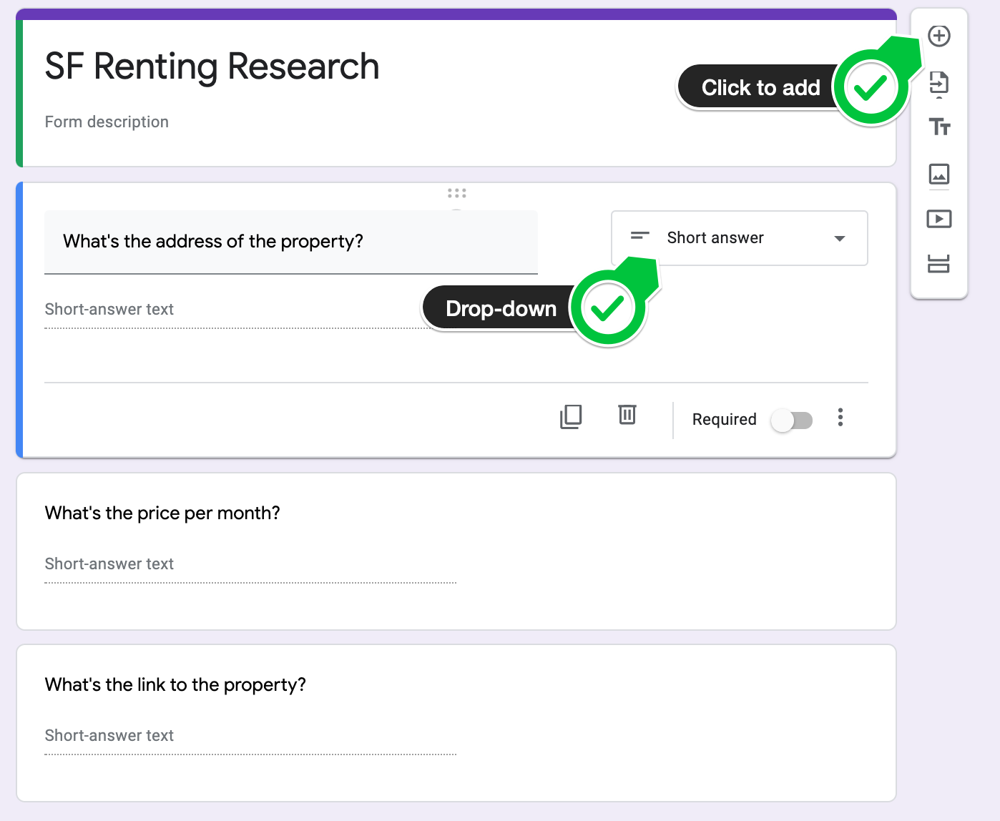
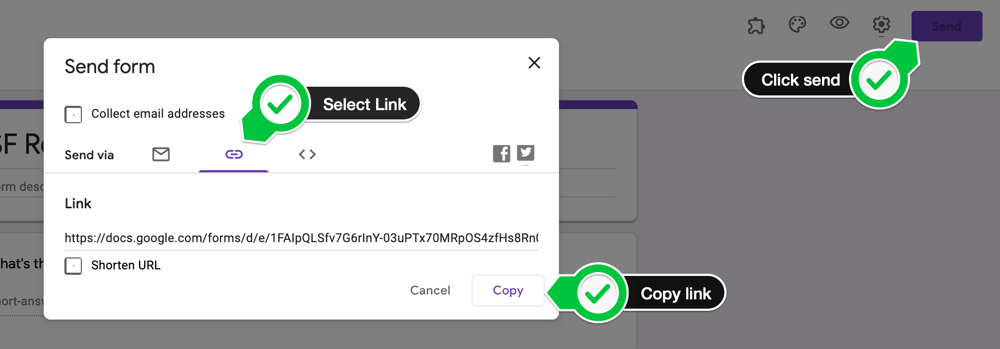
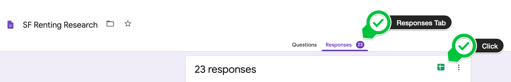

### How to Setup the Zillow Scraper:

1. Go to https://docs.google.com/forms/ and create your own form:

2. Add these 3 questions to the form, make all questions "short-answer":

3. Click send and copy the link address of the form. You will need to use this in your program.

4. Paste the form's url into the user interface for the scraper as directed.

---

### To view the results of the scraper:

Click on the responses tab, and click the google sheets icon to generate a google sheets spreadsheet with the responses.

---