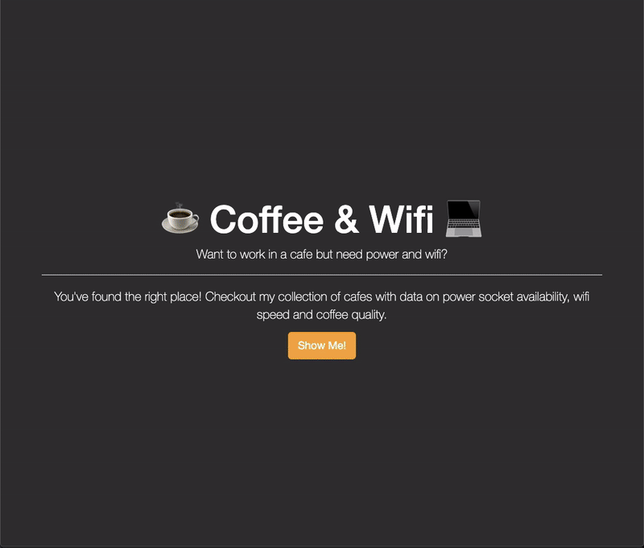

# Day 62 Topics Covered - Coffee & Wifi Project:

Practiced concepts from previous lessons on web development (Flask WTForms, Flask Template Inheritance, [Flask-Bootstrap](https://pythonhosted.org/Flask-Bootstrap/basic-usage.html#available-blocks)) by creating the "Coffee & Wifi" website. 

## Website Demo:

