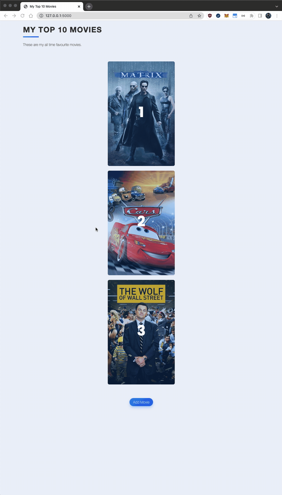
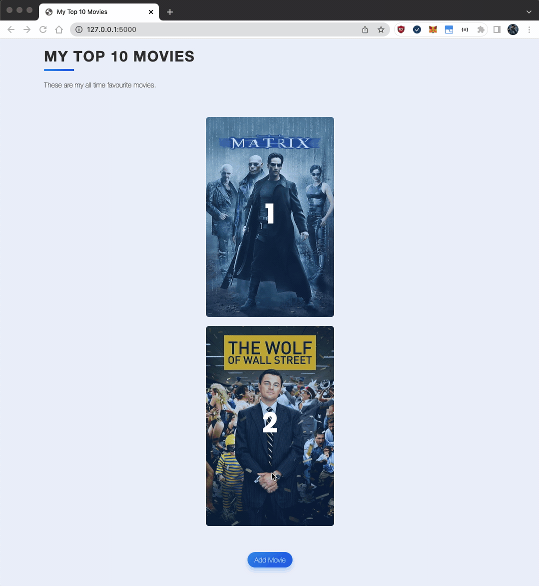
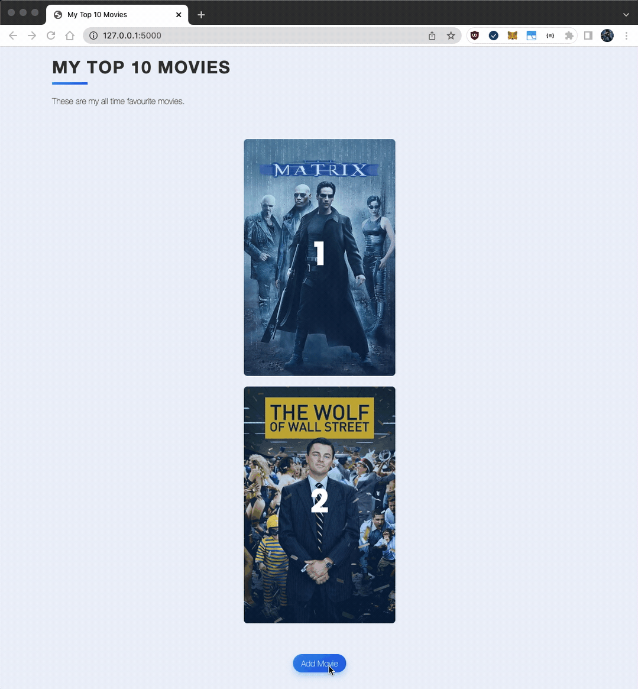

# Day 64 Project - My Top 10 Movies Website

## Notable Features:

- Full CRUD
- Search for movies using [The Movie Database](https://www.themoviedb.org/documentation/api?language=en-US) API integration
- Pagination (WIP)
- Sqlite database accessed using SQLAlchemy

## Demo:

### Home Page & Delete Movie from Database

### Edit Movie

### Add Movie

## Local Setup:

1. cd into the /movie-project directory

2. Install the package requirements with `pip install -r requirements.txt`

3. Run the Flask app with `python3 server.py`