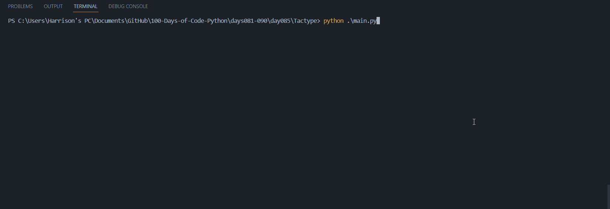

# Tactype - CLI Typing Test

Using Tactype, you can test your typing speed and accuracy. 

It is a simple CLI tool that can be used to test your typing speed and accuracy. It is written in Python and uses the `curses` module to display the text to be typed.

## Local Setup Instructions:

1. Navigate to the /Tactype directory

2. Run the following command to install the required dependencies:

   ```bash
   pip install -r requirements.txt
   ```

   > **Note:** If you are using a UNIX-based system, you can uninstall the `windows-curses` package by running the following command: `pip uninstall windows-curses`

3. Run the following command to start the program:

   ```bash
   python main.py
   ```

## Software Demo:

