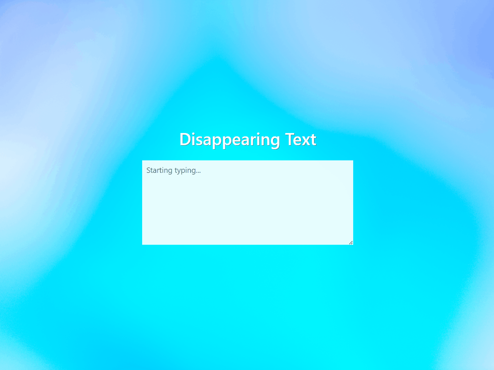

## Day 89 Course Assignment: Disappearing Text Writing App

_Build an online writing app where if you stop typing, work work will disappear_

# Disappearing Text Webapp:

## Overview:

Once the user starts typing, the JavaScript event listeners are initiated.

If the user stops typing for 5 seconds, a warning message will appear, and if the user continues to not type for another 5 seconds, their written text will disappear.

This app is served using Flask, and the front-end was created using HTML, CSS, Bootstrap and JavaScript.

## Local Setup:

1. CD into the `./webapp` directory

2. Install the package requirements using `pip install -r requirements.txt`

3. Run the app using `python app.py`

## App Demo:

