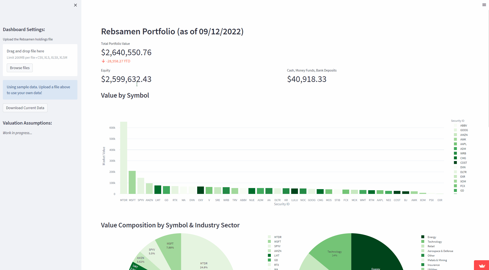

## Day 95 Assignment: Custom API Based Website

_Build a custom website using an API that you find interesting_

# Portfolio Analytics Dashboard

View the official repository here: *https://github.com/hschickdevs/Rebsamen-Portfolio-Analytics*

## Overview

Using the skills that I've learned in the course, I was able to build a dashboard that tracks the holdings and performance of the student managed investment portfolio at my college.

## Technologies Used

This _web application_ was built completely with Python (no coding in HTML, JS, or CSS). In order to accomplish this, I used the following Python packages:
- [`Streamlit`](https://streamlit.io/) framework to simplify the process of building a web data dashboard.
- `Pandas` to view and manipulate the data.

In order to pull stock data, I connected to the [Finnhub API](https://finnhub.io/).

## Software Demo

